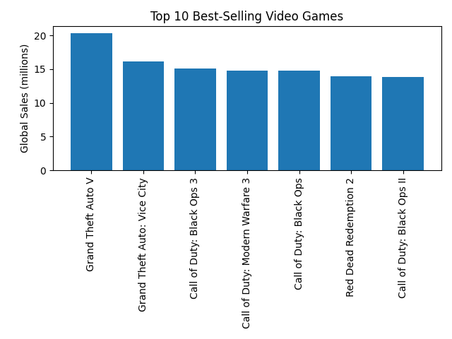

# 🎮 Video Game Sales Visualization

This project explores global video game sales using a dataset from Kaggle.  
It includes data cleaning, exploratory data analysis (EDA), and a set of visualizations that highlight trends across genres, platforms, and years.

The goal is to demonstrate Python skills in:
- Data analysis (Pandas)
- Data visualization (Matplotlib)
- Storytelling with data
- Organizing a clean, reproducible project for GitHub

## 📊 Dataset

**Source:** Kaggle — *Video Game Sales (Short Version)*  
**File used:** `vgsales-12-4-2019-short.csv`  

## 🧰 Tools & Libraries

- Python 3  
- Pandas — data loading & cleaning  
- Matplotlib — visualizations  
- PyCharm — development environment  
